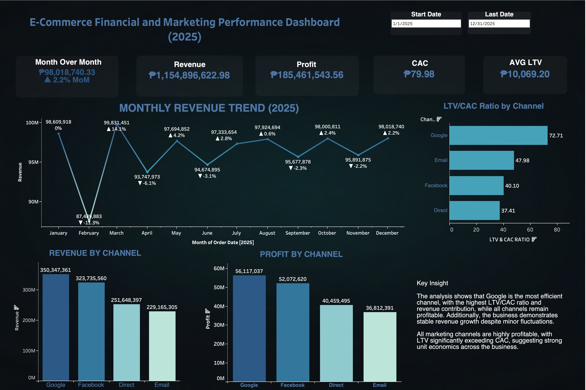

# ecommerce-performance-dashboard
E-commerce dashboard analyzing revenue, profit, CAC, LTV, and marketing performance using SQL and Tableau.

# 📊 E-commerce Financial & Marketing Dashboard

## 📌 Overview
This project analyzes e-commerce performance using SQL and Tableau.  
It focuses on revenue trends, profitability, and marketing efficiency.

---

## 📊 Dashboard Preview

## 📊 Dashboard Live
https://public.tableau.com/views/E-commerceFinancialandMarketingPerformanceDashboard/Dashboard1?:language=en-US&publish=yes&:sid=&:redirect=auth&:display_count=n&:origin=viz_share_link

--- 

## 📈 Key Metrics
- Revenue
- Profit
- Customer Acquisition Cost (CAC)
- Customer Lifetime Value (LTV)
- LTV/CAC Ratio
- Month-over-Month Growth

---

## 🔍 Key Insights
- Google is the most efficient channel with the highest LTV/CAC ratio.
- Revenue remained stable with minor fluctuations throughout the year.
- All channels are highly profitable with strong unit economics.

---

## 🛠 Tools Used
- SQL (PostgreSQL)
- Tableau
- Excel / CSV

---

## 📂 Dataset
- Orders
- Order Items
- Customers
- Marketing Spend

---

## 🚀 How to Use
1. Run SQL queries for analysis
2. Open Tableau dashboard file
3. Explore insights using filters

---

## 💡 Author
Jonathan Olivarez
